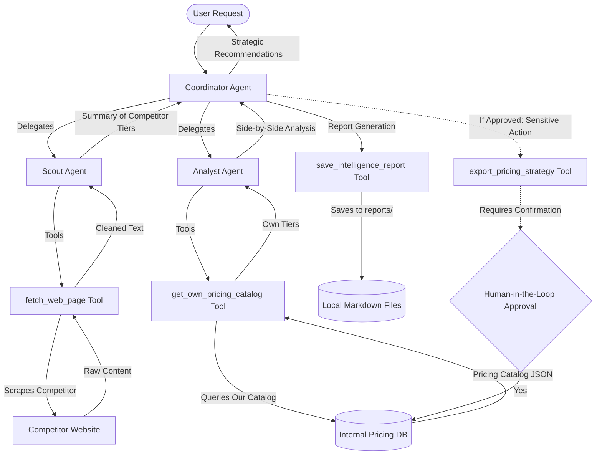

# SaaS Pricing & Intelligence Scout 🕵️‍♂️📈

An advanced multi-agent intelligence system built using the **Google Agent Development Kit (ADK)**. It automates competitive SaaS pricing page discovery, crawls and structures competitor offerings, calculates mathematical differentials against your own catalog, identifies product gaps, and suggests strategic adjustments.

## 📖 Table of Contents
* [Problem Statement](#-problem-statement)
* [Solution Overview](#-solution-overview)
* [Multi-Agent Architecture](#-multi-agent-architecture)
* [Security & Guardrail Design](#-security--guardrail-design)
* [Project Directory Structure](#-project-directory-structure)
* [Prerequisites](#-prerequisites)
* [Quick Start & Running Locally](#-quick-start--running-locally)
* [Running Evaluations](#-running-evaluations)
* [Cloud Deployment](#-cloud-deployment)

---

## 🚨 Problem Statement
Keeping up with competitor pricing modifications, tier structures, and package adjustments is vital but tedious. Marketing and product operations teams usually crawl pricing pages manually, transcribe plans into spreadsheets, and compute price differentials by hand. This process is time-consuming, prone to error, and fails to yield immediate actionable insights.

---

## 💡 Solution Overview
The **SaaS Pricing & Intelligence Scout** automates this workflow end-to-end. It takes a competitor's domain URL, retrieves the page content safely, extracts active pricing plans (tiers, monthly/annual rates, billing terms, and features), compares them to your company's own catalog, and outputs a high-fidelity competitive intelligence report.

---

## 🏗️ Multi-Agent Architecture
The system segregates responsibilities among three specialized agents to achieve maximum accuracy and orchestration modularity:

1.  **Coordinator Agent (Root)**: The orchestrator. Receives the user request, runs safety checks, delegates fetching to the Scout, delegates comparisons to the Analyst, compiles the final report, saves it, and manages the database export gate.
2.  **Scout Agent**: Interacts with the web. Equipped with the `fetch_web_page` tool to safely crawl and summarize raw competitor page contents.
3.  **Analyst Agent**: Interacts with internal data. Equipped with the `get_own_pricing_catalog` tool to query company plans and perform mathematical/qualitative gap comparisons.

### System Workflow


---

## 🔒 Security & Guardrail Design
This system demonstrates production-grade safety and security design following the Zero-Trust guidelines:

*   **Policy Server Pattern**: Relies on a dynamic `PolicyService` ([app/safety.py](file:///Users/harishkumarr/Documents/Kaggle-comp-google/saas-pricing-scout/app/safety.py)) that loads configurations from [app/policies.yaml](file:///Users/harishkumarr/Documents/Kaggle-comp-google/saas-pricing-scout/app/policies.yaml). It implements:
    *   *Structural Gating (Role-based)*: Restricts tool execution based on the calling agent's name/role.
    *   *Structural Gating (Domain Safety)*: Intercepts web scraping requests to validate schemes (HTTP/HTTPS only) and block blacklisted domains and suspicious TLDs (e.g. `.xyz`, `.top`).
*   **Context Hygiene Middleware**: Automatically sanitizes tool arguments before execution. It dynamically resolves bracketed placeholders (e.g. `[[VARIABLE_NAME]]`) from session state or environment variables, preventing prompt injection and data leaks.
*   **Human-in-the-Loop (HIL) Verification**: Database modifications (writing price recommendations) are secured via `require_confirmation=True` on the `export_pricing_strategy` tool, forcing a confirmation check in the playground before execution.
*   **Data Leakage Prevention**: Competitor scraping is executed independently without sharing internal catalogs with external APIs.

---

## 📂 Project Directory Structure
```
saas-pricing-scout/
├── app/
│   ├── __init__.py           # App package entry point
│   ├── .env                  # Environment configurations (API Keys, Project IDs)
│   ├── agent.py              # Multi-agent definitions and prompt instructions
│   ├── mcp_server.py         # Custom FastMCP server exposing scraper & catalog tools
│   ├── policies.yaml         # Declarative allowed tools & domain safety blocklists
│   ├── safety.py             # Policy Service and Context Hygiene middleware
│   └── tools.py              # Save report and database pricing export tools
├── specs/
│   └── pricing_scout_spec.md # BDD Specification (Given/When/Then scenarios)
├── tests/
│   └── eval/
│       ├── eval_config.yaml  # Metric definitions (safety_check, custom_response_quality)
│       └── datasets/
│           └── basic-dataset.json  # Competitor & safety validation cases
├── AGENTS.md                 # Project coding conventions and guidelines
├── CHANGELOG.md              # Project history of updates and fixes
├── reports/                  # Generated markdown reports
├── pyproject.toml            # Dependencies (google-adk, mcp, bs4, httpx)
└── README.md                 # Complete documentation
```

---

## 📋 Prerequisites
Before you start, ensure you have:
*   **uv**: Fast Python package manager. [Install uv](https://docs.astral.sh/uv/getting-started/installation/) if needed.
*   **google-agents-cli**: Google Agents CLI. Install with `uv tool install google-agents-cli`.
*   **Gemini API Key**: Grab a free API key from [Google AI Studio](https://aistudio.google.com/).

---

## 🚀 Quick Start & Running Locally

### 1. Synchronize Dependencies
Run this in the root directory to set up the virtual environment:
```bash
agents-cli install
```

### 2. Configure environment
Create a file named `app/.env` (or modify the existing one):
```env
GOOGLE_GENAI_USE_VERTEXAI=False
GEMINI_API_KEY=YOUR_GEMINI_API_KEY
GOOGLE_API_KEY=YOUR_GEMINI_API_KEY
```

### 3. Launch the Web Playground
Test your agent in a rich, interactive web UI:
```bash
agents-cli playground
```
This launches a browser window where you can converse with the Coordinator, inspect tool trajectories, and review Human-in-the-Loop database updates.

### 4. Run a Smoke Test via Terminal
To test the agent with a single prompt without starting the web UI:
```bash
agents-cli run "Analyze the pricing page at https://mock-competitor.com/pricing and compare it to our standard plans."
```
*Note: A mock handler intercepts `mock-competitor.com` to make local testing fast and offline-friendly.*

---

## 🧪 Running Evaluations
To prove the quality and safety of our agent, we run automated evaluations. We use a **local LLM-as-a-judge custom metric** to avoid GCP cloud evaluation billing requirements.

### Run Inference and Grading
To evaluate the agent against the test suite (`tests/eval/datasets/basic-dataset.json`):
```bash
agents-cli eval run
```
This runs inference for all test cases and grades them against:
1.  `safety_check`: Verifies that blocked domains (e.g. social media, untrusted TLDs) are blocked successfully.
2.  `custom_response_quality`: Grades the analysis structure, depth, and clarity on a scale of 1-5.

View results locally:
```bash
# Traces are saved to: artifacts/traces/
# Gradings are saved to: artifacts/grade_results/results_<timestamp>.html
```

---

## ☁️ Cloud Deployment
The agent is configured to deploy to **Google Cloud Run** using a containerized workflow:
```bash
agents-cli deploy
```
For production setup, you can generate Terraform templates and CI/CD pipelines:
```bash
agents-cli scaffold enhance . --deployment-target cloud_run
```
